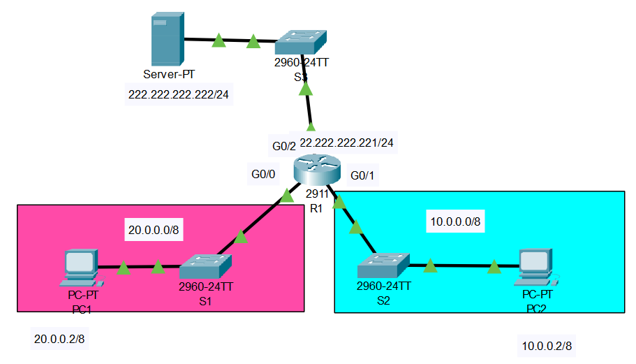

# Configuración de Red Corporativa - Cisco Packet Tracer


## 📋 Descripción

Proyecto de configuración avanzada de infraestructura de red empresarial utilizando Cisco Packet Tracer. Implementación de protocolos de enrutamiento, seguridad de acceso remoto y políticas de control de tráfico para garantizar conectividad segura y controlada entre equipos corporativos.



## 👥 Equipo de Desarrollo

- **Tomás Bravo**
- **Ian Beroíza** 
- **Fabián Grubelic**
- **Juan Jara**
- **Elizabeth Jerez**

## 🎯 Objetivos

- Configurar un router Cisco con múltiples interfaces de red
- Implementar acceso remoto seguro mediante SSH
- Establecer enrutamiento dinámico con protocolo EIGRP
- Aplicar políticas de seguridad con Listas de Control de Acceso (ACL)
- Garantizar conectividad controlada entre dispositivos de red

## 🏗️ Arquitectura de Red

### Topología Implementada
- **Router Principal (R1)**: Cisco con 3 interfaces GigabitEthernet
- **Segmento 1**: Red 20.0.0.0/8 (PC1)
- **Segmento 2**: Red 10.0.0.0/8 (PC2) 
- **Segmento 3**: Red 222.222.222.0/24 (Servidor)

### Direccionamiento IP
| Dispositivo | Interfaz | Dirección IP | Máscara |
|-------------|----------|--------------|---------|
| R1 | Gi0/0 | 20.0.0.1 | 255.0.0.0 |
| R1 | Gi0/1 | 10.0.0.1 | 255.0.0.0 |
| R1 | Gi0/2 | 222.222.222.221 | 255.255.255.0 |
| PC1 | Eth0 | 20.0.0.2 | 255.0.0.0 |
| PC2 | Eth0 | 10.0.0.2 | 255.0.0.0 |
| Servidor | Eth0 | 222.222.222.222 | 255.255.255.0 |

## ⚙️ Configuraciones Implementadas

### 🌐 Configuración Básica del Router
```bash
# Hostname y dominio
R1(config)# hostname R1
R1(config)# ip domain-name desafiolatam.cl
```

### 🔐 Configuración SSH
```bash
# Generación de llaves criptográficas
R1(config)# crypto key generate rsa
# Bits: 2048

# Usuario administrativo
R1(config)# username admin privilege 15 secret cisco123

# Configuración de líneas VTY
R1(config)# line vty 0 4
R1(config-line)# transport input ssh
R1(config-line)# login local
R1(config-line)# exit

# Versión SSH
R1(config)# ip ssh version 2
```

### 🛣️ Protocolo de Enrutamiento EIGRP
```bash
# Activación del protocolo EIGRP
R1(config)# router eigrp 1
R1(config-router)# network 10.0.0.0 0.255.255.255
R1(config-router)# network 20.0.0.0 0.255.255.255
R1(config-router)# network 222.222.222.0 0.0.0.255
R1(config-router)# no auto-summary
```

### 🛡️ Listas de Control de Acceso (ACL)

#### ACL 100: Permitir HTTP desde PC1 al Servidor
```bash
R1(config)# access-list 100 permit tcp host 20.0.0.2 host 222.222.222.222 eq 80
R1(config)# access-list 100 permit ip any any
R1(config)# interface GigabitEthernet0/0
R1(config-if)# ip access-group 100 in
```

#### ACL 101: Denegar ICMP desde PC2 al Servidor
```bash
R1(config)# access-list 101 deny icmp host 10.0.0.2 host 222.222.222.222
R1(config)# access-list 101 permit ip any any
R1(config)# interface GigabitEthernet0/1
R1(config-if)# ip access-group 101 in
```

## 🧪 Pruebas de Conectividad

### ✅ Pruebas Exitosas
- **PC1**: Acceso HTTP al servidor web (www.desafiolatam.cl)
- **PC1**: Ping exitoso al servidor
- **PC2**: Acceso HTTP al servidor web
- **Ambos PCs**: Conexión SSH al router

### ❌ Pruebas Bloqueadas (Por Diseño)
- **PC2**: Ping bloqueado al servidor por ACL 101

## 🔧 Tecnologías Utilizadas

- **Cisco Packet Tracer**: Simulador de redes
- **EIGRP**: Protocolo de enrutamiento dinámico
- **SSH v2**: Acceso remoto seguro
- **ACL**: Listas de control de acceso
- **TCP/IP**: Protocolo de comunicación
- **DNS**: Resolución de nombres de dominio
- **HTTP**: Protocolo de transferencia web

## 📚 Conceptos Implementados

### Seguridad de Red
- Autenticación mediante SSH
- Control de acceso por ACLs
- Cifrado de comunicaciones

### Enrutamiento
- Configuración de interfaces múltiples
- Protocolo EIGRP para enrutamiento dinámico
- Desactivación de auto-sumarización

### Administración
- Configuración remota segura
- Políticas de tráfico granulares
- Verificación de conectividad

## 📈 Resultados Obtenidos

- ✅ **100% de conectividad** entre equipos autorizados
- ✅ **Acceso SSH seguro** desde ambos PCs al router
- ✅ **Control de tráfico eficaz** mediante ACLs
- ✅ **Enrutamiento dinámico** funcionando correctamente
- ✅ **Políticas de seguridad** implementadas exitosamente

## 🚀 Conclusiones

La implementación exitosa de esta infraestructura de red demuestra:

1. **Conectividad Segura**: Los equipos pueden comunicarse de manera controlada
2. **Acceso Remoto**: SSH proporciona administración segura del router
3. **Control de Tráfico**: Las ACLs permiten políticas granulares de acceso
4. **Escalabilidad**: EIGRP facilita el crecimiento futuro de la red
5. **Seguridad Integral**: Múltiples capas de seguridad protegen la infraestructura

---

**Desarrollado por**: Equipo TrenAlSur  
**Institución**: DesafíoLatam  
**Tecnología**: Cisco Packet Tracer
